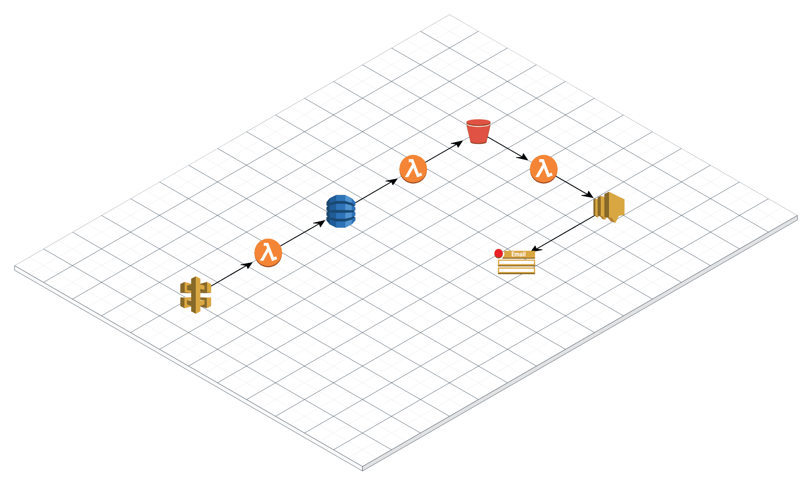

# Serverless Framework vs AWS SAM

[Serverless](https://www.serverless.com)

[SAM](https://github.com/awslabs/serverless-application-model)

## Infrastructure



## Deploy

### Serverless

```sh
export SNS_EMAIL=youremail@here
./auto/deploy
```

### SAM
export s3bucket=sls-vs-sam-dev-serverlessdeploymentbucket-1sv3s216g9uxt
> sam package --template-file template.yml --s3-bucket $s3bucket --output-template-file package.yml
> sam deploy --template-file package.yml --stack-name sls-vs-sam-SAM --capabilities CAPABILITY_IAM --region ap-southeast-1

> rea-as saml locke-dev-Developer yarn sam-deploy --region ap-southeast-1
