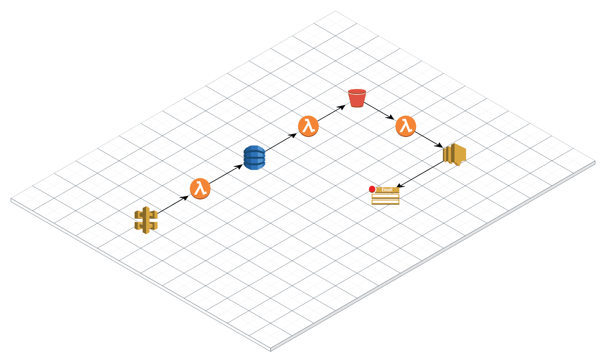

# Serverless Framework vs AWS SAM

[Serverless](https://www.serverless.com)

[SAM](https://github.com/awslabs/serverless-application-model)

## Infrastructure



### 1.Serverless
- Very powerful and flexible, I like it.
- Wrote in node.js
- Heaps of plugins, like serverless-offline
- But not from aws, its template is not exactly same with cloudformation, not support !Sub !Ref
```sh
export SNS_EMAIL=youremail@here
./auto/deploy
```

### 2.SAM
- Generate roles easier then sls
- Create lambda logs auto but not in template
- Sam is a cli tool wrote in python, need a proper docker to use it in ci.
- You need to create s3 first for deploy
- Code file name is uuid while sls has data time stamp
- No outputs during deploy
```sh
export s3bucket=yourDeployS3Bucket
> sam package --template-file sam-template.yml --s3-bucket $s3bucket --output-template-file sam-output-template.yml
> sam deploy --template-file sam-output-template.yml --stack-name sls-vs-sam-sam --capabilities CAPABILITY_IAM --region ap-southeast-1
```

### 3.Cloudformation
- Customized package and deploy using simplified cloudformation with Transform
- Use `Transform: AWS::Serverless-2016-10-31` in cloudformation and package yourself then use `aws cloudformation deploy`
- Write cloudformation like sam-output-template.yml

```sh
aws cloudformation deploy --template-file sam-output-template.yml --stack-name sls-vs-sam-sam --region ap-southeast-1 --capabilities CAPABILITY_IAM
```
- update parameter value doesn't create new changeset, no changes to deploy.
- update key value directly in CodeUri under function will deploy new code.
